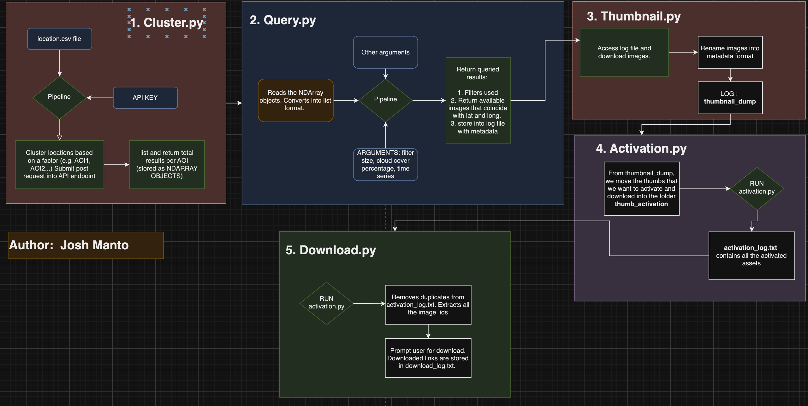
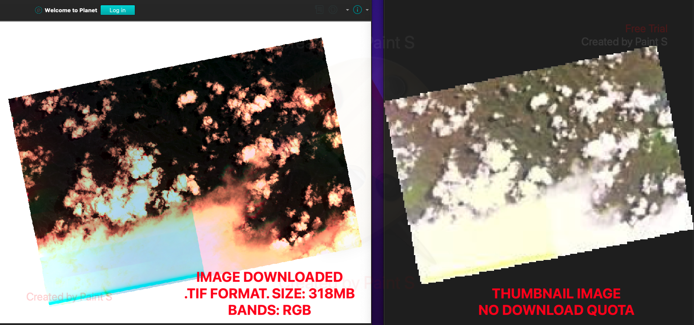

# Planetscope Pipeline

This project involves querying, clustering, and downloading satellite images from Planet.com using their API. It includes three main Python scripts: `query.py`, `thumbnail.py`, and `cluster.py`. Each script is responsible for different parts of the workflow.

## Overview

- **Cluster.py**: Clusters geographical coordinates from a CSV file using the DBSCAN algorithm.
  - Displays the Area of Interests in increasing order (e.g., AOI1, AOI2).
  - AOI1 and AOI2 are stored as NDARRAY objects.
  - Sample usage: `python Cluster.py --input_csv path/to/locations.csv --epsilon 0.01 --min_samples 5`
 
    
  
- **Query.py**: Queries the Planet API for satellite images based on clustered coordinates, filtering by date range and cloud cover, and logs thumbnail URLs and metadata into a thumbnail log file.
  - Submits POST requests to the Planet.com API endpoint to query images that match the latitudes and longitudes from our CSV file.
  - Converts NDArray objects from `Cluster.py` to lists, then to JSON, and finally makes POST requests to the Planet.com API endpoint.
  - Sample usage: `python Query.py --api_key your_api_key --start_date YYYY-MM-DD --end_date YYYY-MM-DD --cloud_cover 0.5 --aoi 2 --input_csv path/to/locations.csv --result_limit 5 --log_file thumbnails.log`
 
    

- **Thumbnail.py**: Downloads and saves the thumbnails of the queried satellite images, renaming them based on metadata.
  - Sample usage: `python Thumbnail.py --log_file thumbnails.log`
    
 
- **Example Log File Entry**
`Results for AOI2:
https://tiles.planet.com/data/v1/item-types/PSScene/items/20200121_092611_01_106b/thumb
Image ID: 20200121_092611_01_106b, Cloud Cover: 0.45, Date: 20200121`

- **Activation.py**: Activates image assets based on user input.
  - Reads image IDs from the `thumb_activation` folder and checks their activation status.
  - Prompts the user to activate image assets and logs the activation status in `activation_log.txt`.
  - Sample usage: `python Activation.py`
 

- **Download.py**: Generates download links for activated image assets based on user input.
  - Reads active image IDs from `activation_log.txt`.
  - Prompts the user to generate download links for each image asset and logs the download links in `download_log.txt`.
  - Sample usage: `python Download.py`
  

## Important Notes

1. Ensure that you move files from the `thumbnail_dump` folder into the `thumb_activation` folder before running `Activation.py`.
2. The `activation_log.txt` file logs the activation status of image IDs.
3. The `download_log.txt` file logs the download links for the image IDs.

## MAIN RESULTS: 

   

## **PROJECT STILL UNDER PROGRESS**
Future implementations: 
1. ~~Select and send image assets into API endpoint for activation~~
2. "CLIP" function to clip the downloaded images into our desired size (careful about the download quota)
3. ~~Generate download links for each image~~

